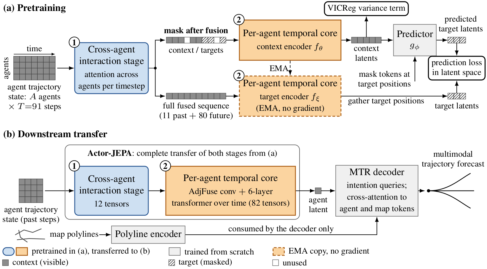

# Actor-JEPA: Multi-Agent Motion Forecasting using Latent-Predictive Pretraining

> **Paper under double-blind review.** This page accompanies the submission.
> Code and pretrained weights will be released here — see [Release status](#release-status).

---

## Abstract

Motion forecasting models must capture how agents influence one another, and are
trained on large labelled trajectory datasets. Self-supervised pretraining promises
to reduce that dependence on labels, yet reported results conflict, ranging from
substantial gains to null results. We introduce
Actor-JEPA, which applies the Joint-Embedding Predictive Architecture to
multi-agent scene encoding. Its encoder factorises the scene into a cross-agent
interaction stage followed by per-agent temporal encoding, and that factorisation
defines the prediction target: agents are mixed before masking, so the
model predicts masked agent-timestep positions in a representation that already
carries interaction context, rather than reconstructing coordinates. Across four label
regimes and $14$ independent pretraining runs on the Waymo Open Motion Dataset, Actor-JEPA raises
peak mAP from $0.2089 \pm 0.0111$ to $0.2245 \pm 0.0159$ at $20\%$ labels
(+7.4\% relative, $p=0.006$, n=14) and from $0.2799 \pm 0.0086$ to
$ 0.2938 \pm 0.0096 $ at full labels (+5.0\%, $p=0.026$, n=6), in each case against the identical
architecture trained from scratch. Within a dataset, two conditions govern
whether any benefit appears: the cross-agent stage must be transferred, since the
per-agent core alone performs at from-scratch level, and pretraining must stop before a representation
collapse that neither the pretext loss nor the variance regulariser reveals, which
we detect by monitoring the effective rank of the encoder's features.

---

## Architecture

**(a) Pretraining.** The cross-agent interaction stage runs *first*, attending across agents at
each timestep. Masking is applied to the resulting **fused** sequence, so a target position is
already a mixture of the scene rather than a single agent's coordinates. A per-agent temporal
core encodes the masked sequence; an EMA copy encodes the full sequence to produce targets; a
predictor maps context latents to target positions, and the loss is taken in latent space.

**(b) Downstream transfer.** Both pretrained stages are transferred into an MTR forecasting model and fine-tuned. The
map polyline encoder and the decoder are trained from scratch.

---

## Main results

Peak mAP on the Waymo Open Motion Dataset, pretrained vs. the identical architecture trained
from scratch. **Each replication is an independent pretraining run**, not a fine-tuning seed, so
*n* counts encoders. *p* is a Welch two-sample test and Mann–Whitney agrees throughout.

| Labels | Pretrained | From scratch | Δ | Welch *p* |
|:--|:--|:--|:--|:--|
| 100% (*n* = 6)  | **0.2938 ± 0.0096** | 0.2799 ± 0.0086 | **+5.0%** | 0.026 |
| 20% (*n* = 14)  | **0.2245 ± 0.0159** | 0.2089 ± 0.0111 | **+7.4%** | 0.006 |
| 10% (*n* = 12)  | **0.2010 ± 0.0132** | 0.1891 ± 0.0058 | **+6.3%** | 0.013 |
| 5% (*n* = 12)   | **0.1783 ± 0.0108** | 0.1664 ± 0.0061 | **+7.2%** | 0.005 |

The gain is consistent in sign and roughly constant in relative size across an order of
magnitude of label budget. However, it does not grow as labels become scarce, which is the behaviour
usually assumed of self-supervised pretraining. What makes the effect measurable at all is the
replication count: earlier experiments on this architecture with *n* ≤ 6 produced nulls that
were underpowered rather than negative, and run-to-run spread between independent pretrainings
is large enough that small studies cannot resolve a 5–7% effect.

### Which part of the encoder carries the benefit

Transferring subsets of the same pretrained encoder, split by parameter tensor, at 20% labels.
Each row is five independent encoders. *p* is a one-sample test against the from-scratch mean.

| Transferred | Peak mAP | vs. scratch | *p* |
|:--|:--|:--|:--|
| Neither (from scratch, *n* = 14) | 0.2089 ± 0.0111 | — | — |
| Per-agent core only | 0.2056 ± 0.0062 | −1.6% | 0.31 |
| **Cross-agent stage only** | **0.2237 ± 0.0074** | **+7.1%** | **0.011** |
| Complete transfer | 0.2147 ± 0.0264 | +2.8% | 0.65 |

The 12-tensor cross-agent stage recovers the benefit on its own while the 82-tensor per-agent core
recovers none of it. This is the practical consequence of masking after fusion. What
pretraining learns is how agents relate, and a transfer that silently drops those 12 tensors
performs at from-scratch level while appearing to have loaded a pretrained encoder.

### A collapse that standard monitoring does not reveal

During long pretraining runs the encoder's representation can collapse from an effective rank of
~56 to ~2 **within a single epoch**, while both the pretext loss and the VICReg variance term
stay flat. Neither signal a practitioner would normally watch reflects the event. We monitor the
effective rank of the encoder's features directly and stop pretraining before it occurs.

### Scope

The gain is established *within* a dataset. In cross-dataset transfer to Argoverse 2 (12
pretrained vs. 12 from-scratch runs) we measure no benefit, at full labels or in low-label
regimes. We also report a matched-budget control in which pretraining and fine-tuning use the
*same* scenario subset, removing the extra unlabelled data the pretext task otherwise sees.
Confining the pretext task to the same
$20\%$ subset the decoder is fine-tuned on, at equal gradient steps, leaves
$+1.6\%$ over from-scratch ($0.2122 \pm 0.0092$ against $0.2089$, $p=0.62$,
three pretraining runs) where pretraining on the full split gives $+7.4\%$.

---

## Release status

**Code and pretrained model weights will be released here.** The release will include:

- the Actor-JEPA pretraining implementation (fused-then-masked encoder, EMA target branch, VICReg variance term);
- the downstream transfer path into the MTR forecasting model;
- pretrained encoder checkpoints for the runs behind the tables above;
- the effective-rank monitor used to detect the collapse, and the evaluation scripts that produce the per-epoch mAP trajectories.

Until then this page is a placeholder so the submission has a stable link.

---

## Citation

A BibTeX entry will be added once the review process concludes.
